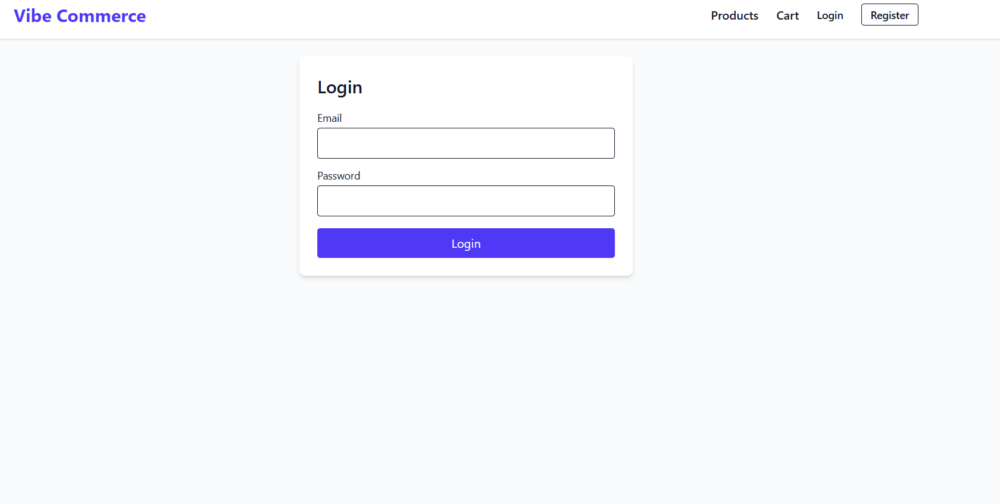
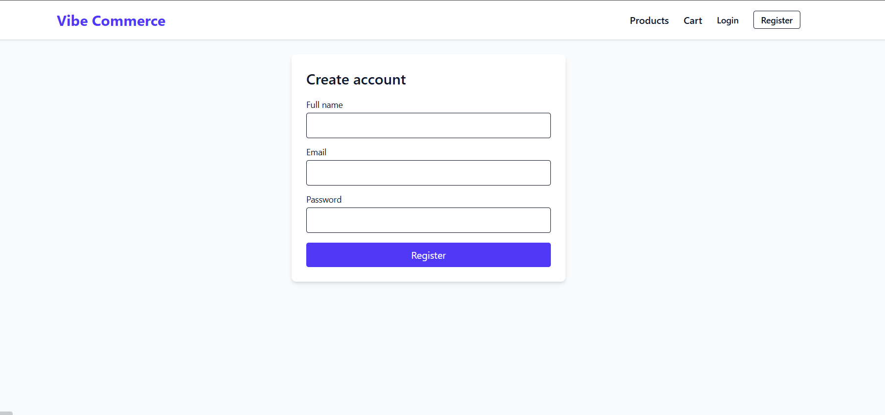
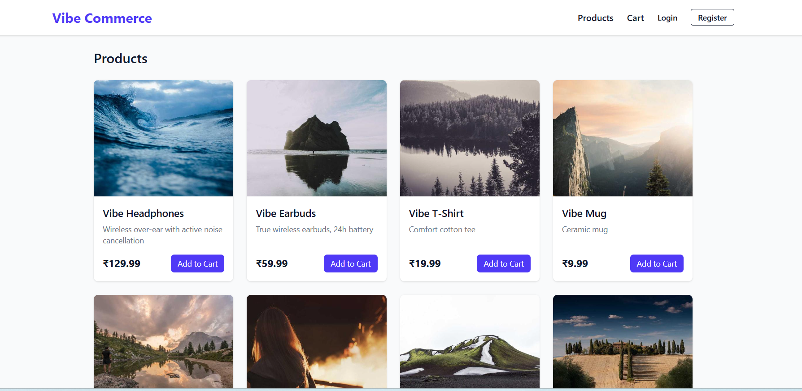
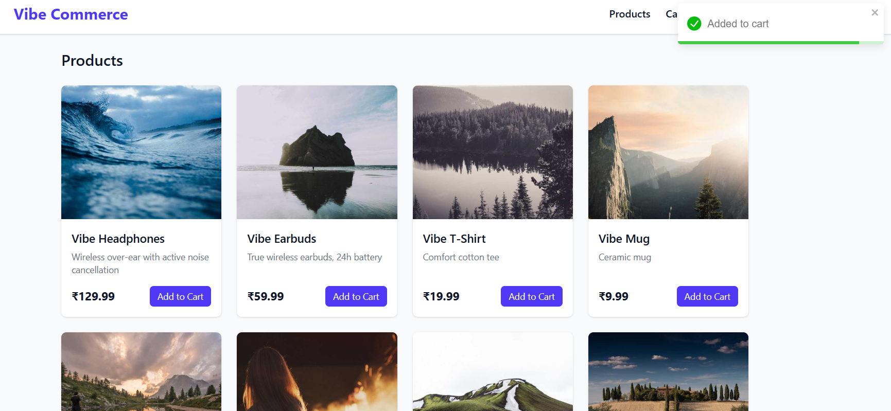
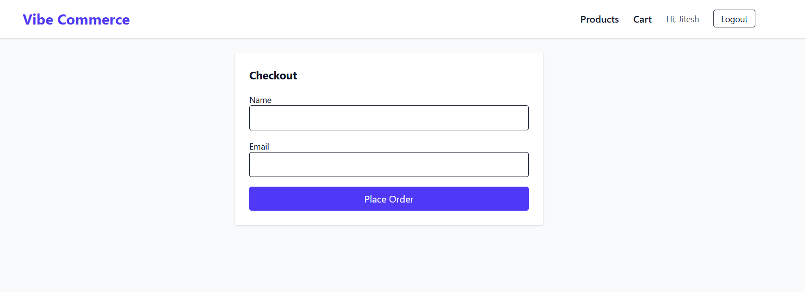
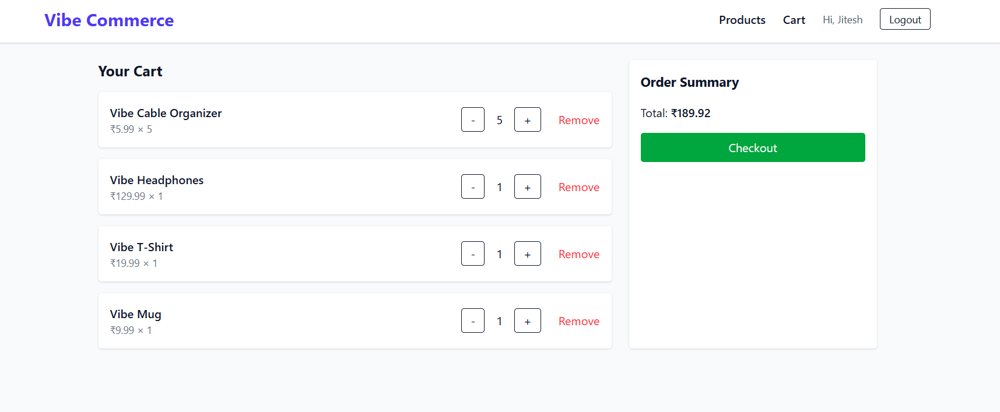

# 🛒 Vibe Commerce - Full Stack E-Commerce Cart
It’s a complete mock shopping cart app demonstrating **frontend + backend integration**, **database persistence**, and **checkout flow**.

---

## 🚀 Features

✅ **Frontend (React + Vite)**
- Beautiful, responsive product grid (10 seeded demo items)
- Add to Cart / Remove / Update quantity
- Checkout form with mock receipt modal
- Login, Register, and Logout (JWT Auth)
- Toast notifications using `react-toastify`
- Tailwind CSS for styling

✅ **Backend (Node.js + Express)**
- REST API endpoints for products, cart, and checkout
- SQLite database with seed data (10 items)
- JWT authentication with register/login/logout
- Persistent user and cart data
- Bonus: Fake Store API sync route

---

## 🧠 Tech Stack

**Frontend:**
- React (Vite)
- Tailwind CSS
- React Router
- Axios
- React Toastify

**Backend:**
- Node.js
- Express.js
- SQLite (better-sqlite3)
- JWT Authentication
- bcryptjs for password hashing
- dotenv for environment configuration

---

## ⚙️ Setup Instructions

Follow these steps to run the project locally.

---

### 🗄️ Backend Setup

```bash
# Navigate to backend folder
cd backend

# Install dependencies
npm install

# Create .env file in backend directory and add:
PORT=5000
JWT_SECRET=your_secret_key

# Run the backend (development mode)
npm run dev

```
---

### 💻 Frontend Setup

```bash
# Navigate to frontend folder
cd frontend

# Install dependencies
npm install

# Create .env file in frontend directory and add:
VITE_API_URL=http://localhost:5000/api

# Run the frontend (Vite dev server)
npm run dev
<<<<<<< HEAD
```
---

## 🧾 API Reference

Base URL: `http://localhost:5000/api`

### Endpoints

| Method | Endpoint | Description |
|--------|-----------|-------------|
| GET | `/products` | Fetch all available products |
| POST | `/cart` | Add product to user cart (`{ "productId": <id>, "qty": <number> }`) |
| GET | `/cart` | Retrieve current user's cart and total |
| DELETE | `/cart/:id` | Remove item from user cart by ID |
| POST | `/checkout` | Checkout cart → returns mock receipt |

---

### 🧠 Example Requests

**Get all products**
```bash
curl http://localhost:5000/api/products
```

**Add product to cart**
```bash
curl -X POST http://localhost:5000/api/cart \
  -H "Content-Type: application/json" \
  -d '{"productId": 3, "qty": 2}'
```

**Get cart**
```bash
curl http://localhost:5000/api/cart
```

**Checkout**
```bash
curl -X POST http://localhost:5000/api/checkout \
  -H "Content-Type: application/json" \
  -d '{"cartItems": [{"productId": 3, "qty": 2}]}'
```
## 📸 Screenshots

| Login | Register |
|-------|-----------|
|  |  

| Products | Added To cart |
|--------------|------|
|  |  |

| Checkout | Cart |
|--------------|------|
|  |  |
